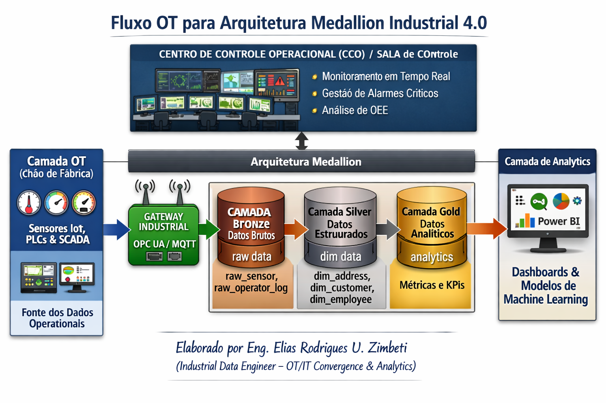

# industrial-data-architecture-medallion
Unified Industrial Data Architecture: OT/IT Convergence with IoT Gateway and Medallion Lakehouse for Real-Time Analytics.

# Arquitetura Unificada de Dados Industriais: Convergência OT/IT com Gateway IoT e Data Lakehouse Medallion para Analytics em Tempo Real

Este repositório contém a documentação completa, especificações de engenharia e roteiros para a implementação de um pipeline de dados industrial alinhado aos conceitos de Indústria 4.0.

---

##  Estrutura Geral da Solução

O projeto conecta variáveis de dispositivos físicos no chão de fábrica a uma estrutura moderna de Data Lakehouse analítico, garantindo baixa latência para o Centro de Controle Operacional (CCO) e consistência para relatórios gerenciais.

---

## 📂 Documentação Detalhada do Projeto

Para facilitar a leitura e a manutenção do projeto, a documentação técnica foi estruturada em arquivos modulares dentro do próprio ecossistema do repositório. Acesse os links abaixo para ler os documentos de engenharia:

### [1. Modelo de Requisitos](./docs/1_MODELO_DE_REQUISITOS.md)
*Mapeamento completo do projeto, escopo de entrega, usuários e critérios de sucesso.*
* Requisitos Funcionais (FR) e Não Funcionais (NFR).
* Gestão de segurança, resiliência (Store-and-Forward) e isolamento de redes (OT/IT).
* Premissas operacionais e restrições de largura de banda industrial.

###  [2. Modelo de Funcionamento (Arquitetura e Fluxo)](./docs/2_MODELO_DE_FUNCIONAMENTO.md)
*Detalhamento técnico da jornada do dado e evolução estrutural.*
* Divisão das responsabilidades das camadas **Bronze** (dados brutos), **Silver** (dados estruturados e contextualizados) e **Gold** (métricas de negócio).
* Fluxo contínuo *end-to-end* do sensor ao CCO.
* Exemplo prático de payloads JSON bruto e transformação em tabelas dimensionais.

###  [3. Roteiro Prático de Implementação](./docs/3_PASSO_A_PASSO_PRATICO.md)
*Guia passo a passo para reproduzir o ambiente de desenvolvimento local ou em nuvem.*
* Emulação de telemetria industrial via Docker (Mosquitto MQTT / Python).
* Configuração do Gateway de borda (Node-RED / NiFi) e ingestão via PySpark / Delta Lake.
* Engenharia de agregados para cálculo automático de métricas de OEE (Disponibilidade, Performance e Qualidade).

---

##  Tecnologias Utilizadas

* **Protocolos e Borda (OT):** OPC UA, MQTT, Node-RED / Apache NiFi.
* **Mensageria & Big Data Ingestion:** Apache Kafka, Delta Lake.
* **Processamento e Computação:** Python (PySpark), SQL.
* **Plataforma Nuvem & Analytics:** Microsoft Azure, Databricks, Power BI.

---
*Elaborado por Eng. Elias Rodrigues U. Zimbeti (Industrial Data Engineer – OT/IT Convergence & Analytics)*
