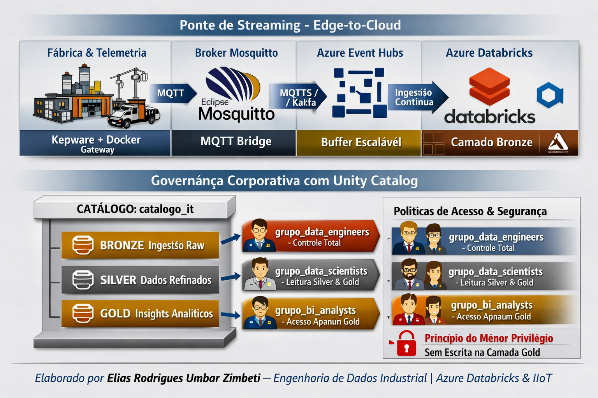

# 3.3. Engenharia Data Lakehouse: Integração Streaming & Governança Corporativa (Unity Catalog)



Esta etapa documenta as duas bases fundamentais que sustentam a chegada e a segurança do dado industrial na nuvem:
1. **A Ponte de Streaming (Edge-to-Cloud):** O fluxo de tráfego contínuo que conecta nosso ecossistema de borda (Kepware + Docker Mosquitto) ao Azure Databricks em tempo real.
2. **A Governança com Unity Catalog:** A blindagem do ambiente, isolamento de escopos e a política de controle de acesso para as camadas Medallion.

---

## 3.3.1. A Ponte de Streaming (Edge-to-Cloud)

Para que a telemetria gerada no chão de fábrica atinja a nuvem de forma imediata e sem perdas, a arquitetura utiliza um modelo de desacoplamento resiliente e baseado em eventos:


### Mecanismo de Funcionamento da Ponte:
1. **Roteamento Local:** O gateway MQTT do Kepware publica o payload JSON estruturado no broker local **Eclipse Mosquitto** (rodando em nossa infraestrutura Docker) no tópico `industria/luanda/linha01/telemetria`.
2. **Transmissão Segura (MQTT Bridge):** O Mosquitto local é configurado via arquivo `.conf` para atuar como uma ponte criptografada direta com o **Azure Event Hubs** (utilizando o protocolo MQTTS via porta `8883` ou HTTPS/Kafka via porta `9093`).
3. **Desacoplamento e Escala (Azure Event Hubs):** O Event Hubs expõe um endpoint compatível nativamente com a **API do Apache Kafka**, servindo como buffer elástico capaz de reter o streaming mesmo durante picos de transmissão ou manutenção de rede.
4. **Ingestão Contínua (Azure Databricks):** O Databricks mantém uma conexão aberta e redundante com o Event Hubs através de uma sessão do **Spark Structured Streaming**, consumindo o payload de forma incremental e persistindo-o imediatamente na camada Bronze em formato Delta Lake.

---

## 3.3.2. Governança Corporativa com Unity Catalog

O **Unity Catalog** é o motor unificado de governança do nosso Lakehouse. Ele substitui o antigo modelo de metadados legados (Hive Metastore), aplicando segurança centralizada e linhagem ponta a ponta baseada na arquitetura de três níveis (`catalogo.esquema.tabela`).

               ┌──────────────────────────────┐
               │     CATÁLOGO: catalogo_it    │
               └──────────────┬───────────────┘
                              │
     ┌────────────────────────┼────────────────────────┐
     ▼                        ▼                        ▼


     ### Isolamento de Ambientes e Diretórios
Cada camada da arquitetura Medallion é isolada logicamente dentro do catálogo corporativo para garantir que dados brutos fiquem restritos ao processamento de sistema, enquanto dados agregados e analíticos fiquem visíveis aos consumidores:

* **`catalogo_it.bronze`**: Armazena as tabelas Delta de ingestão rápida e de escrita incremental (*Append-Only*). Apenas o usuário de serviço (*Service Principal*) que roda o pipeline de engenharia possui direito de gravação.
* **`catalogo_it.silver`**: Contém dados padronizados e limpos, onde a qualidade de engenharia é aplicada. É o ponto de partida seguro para exploração técnica de dados por times de engenharia avançada.
* **`catalogo_it.gold`**: Apresenta as views analíticas e tabelas prontas para consumo direto em ferramentas como Power BI e modelos de machine learning.

### Políticas de Segurança e Controle de Acesso (Grants)
O acesso é regido pelo princípio do menor privilégio, utilizando grupos de segurança corporativos integrados ao Azure Active Directory:

```sql
-- ============================================================================
-- 1. PROVISIONAMENTO DO CATÁLOGO E CAMADAS MEDALLION
-- ============================================================================
CREATE CATALOG IF NOT EXISTS catalogo_it;
USE CATALOG catalogo_it;

CREATE SCHEMA IF NOT EXISTS bronze;
CREATE SCHEMA IF NOT EXISTS silver;
CREATE SCHEMA IF NOT EXISTS gold;

-- ============================================================================
-- 2. POLÍTICA DE PRIVILÉGIOS COM GRANTS (UNITY CATALOG)
-- ============================================================================

-- A) Time de Engenharia de Dados (Controle Total de Alterações e Pipelines)
GRANT ALL PRIVILEGES ON CATALOG catalogo_it TO `grupo_data_engineers`;

-- B) Time de Data Science (Acesso para leitura de dados históricos limpos na Silver e Gold)
GRANT USAGE ON CATALOG catalogo_it TO `grupo_data_scientists`;
GRANT SELECT ON SCHEMA silver TO `grupo_data_scientists`;
GRANT SELECT ON SCHEMA gold TO `grupo_data_scientists`;

-- C) Analistas de BI e Negócios (Consumo estritamente restrito à camada Gold)
GRANT USAGE ON CATALOG catalogo_it TO `grupo_bi_analysts`;
GRANT SELECT ON SCHEMA gold TO `grupo_bi_analysts`;

-- D) Garantir o Princípio do Menor Privilégio: Revogar qualquer direito de escrita 
-- na camada Gold para usuários de consumo (garante integridade do dado de negócio)
REVOKE MODIFY ON SCHEMA gold FROM `grupo_bi_analysts`;
