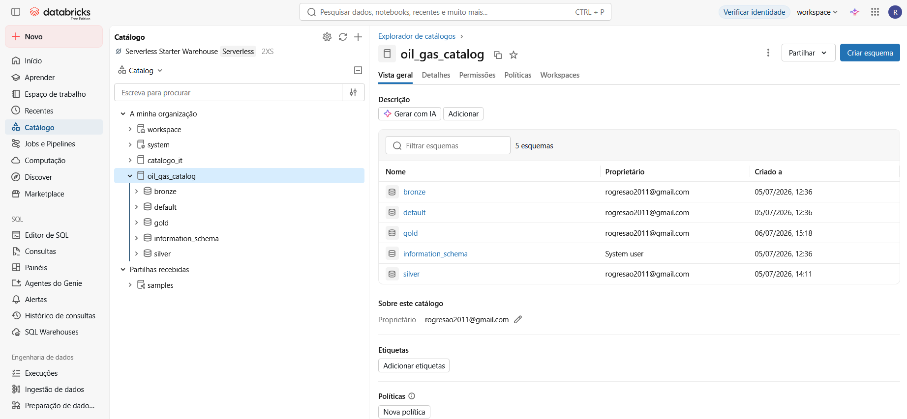

# 3.4. Criação da Infraestrutura do Data Lakehouse e Governança no Unity Catalog

Esta etapa documenta o provisionamento e a estruturação lógica e física do armazenamento de dados utilizando o **Azure Databricks** e o **Unity Catalog**. Demonstramos aqui a criação de catálogos dedicados a ativos de dados industriais (como `oil_gas_catalog` e `catalogo_it`) e a estruturação das camadas Medallion.

---

## 3.4.1. Estrutura de Catálogos e Schemas (Unity Catalog)

Para suportar operações de missão crítica na indústria de energia e manufatura, isolamos nossos ambientes de forma corporativa na estrutura de três níveis (`catalogo.schema.tabela`). 

A imagem abaixo apresenta o provisionamento real do catálogo **`oil_gas_catalog`** operando no painel administrativo do Databricks:



### Divisão de Responsabilidades no Catálogo:
* **`bronze`**: Schema onde residem as tabelas brutas e imutáveis (*raw*). É a porta de entrada para a telemetria ou ingestão de arquivos.
* **`silver`**: Schema dedicado aos dados tipados, limpos e integrados corporativamente.
* **`gold`**: Schema voltado para consumo analítico e de Business Intelligence (BI), contendo visões agregadas e tabelas de fatos prontas para geração de insights.

---

## 3.4.2. Ingestão e Processamento Prático na Arquitetura Medallion

Abaixo, descrevemos o fluxo de execução das queries SQL utilizadas no nosso notebook corporativo para mover e transformar as informações entre as camadas de dados de forma segura.

### 1. Camada Bronze: Ingestão de Arquivos Raw via Volumes
Para cenários de carga em lote (batch) ou arquivos estáticos, o Unity Catalog fornece o conceito de **Volumes** para armazenar arquivos não estruturados/semiestruturados de forma segura. Criamos a tabela Bronze lendo diretamente esses arquivos:

```sql
-- Criação do Volume para recepção dos arquivos brutos
CREATE VOLUME IF NOT EXISTS catalogo_it.bronze.adventureworks_raw;

-- Criação da Tabela Bronze com Ingestão via read_files
CREATE OR REPLACE TABLE catalogo_it.bronze.raw_customer
AS SELECT 
    _c0 AS CustomerID,
    _c1 AS PersonID,
    _c2 AS StoreID,
    _c3 AS TerritoryID,
    _c4 AS AccountNumber,
    _c5 AS rowguid,
    _c6 AS ModifiedDate
FROM read_files(
  '/Volumes/catalogo_it/bronze/adventureworks_raw/Customer.csv',
  header => false,
  inferSchema => true,
  sep => '\t'
);


CREATE OR REPLACE TABLE catalogo_it.silver.dim_customer AS
SELECT 
    try_cast(trim(CustomerID) as INT) AS customer_id,
    try_cast(trim(PersonID) as INT) AS person_id,
    try_cast(trim(StoreID) as INT) AS store_id,
    try_cast(trim(TerritoryID) as INT) AS territory_id,
    trim(AccountNumber) AS account_number,
    trim(rowguid) AS row_guid,
    try_cast(trim(ModifiedDate) as TIMESTAMP) AS modified_date,
    current_timestamp() AS data_ingestao
FROM catalogo_it.bronze.raw_customer;


CREATE OR REPLACE TABLE catalogo_it.gold.fact_employee_demographics AS
SELECT 
    business_entity_id,
    job_title,
    gender,
    marital_status,
    vacation_hours,
    sick_leave_hours,
    floor(datediff(current_date(), birth_date) / 365.25) AS age_years,
    floor(datediff(current_date(), hire_date) / 365.25) AS tenure_years,
    is_current
FROM catalogo_it.silver.dim_employee
WHERE is_current = true;


-- Validação quantitativa e checagem de integridade de IDs nulos
SELECT 
    'Silver - dim_customer' AS tabela,
    COUNT(*) AS total_registos,
    COUNT(CASE WHEN person_id IS NULL THEN 1 END) AS total_person_id_null
FROM catalogo_it.silver.dim_customer;


