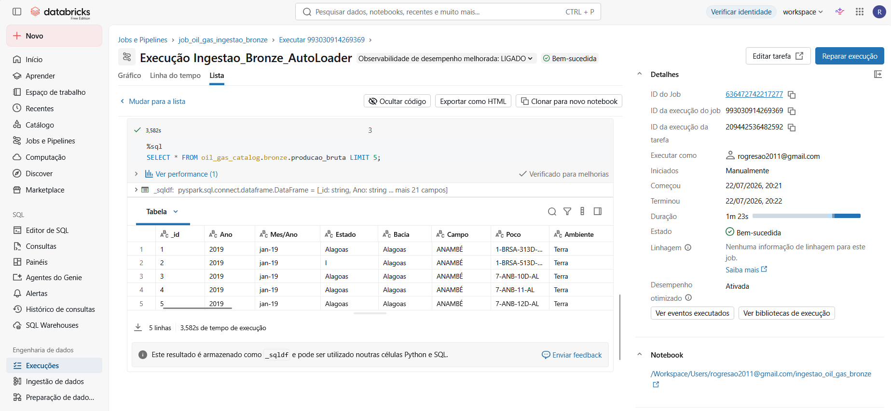

# 3.6. Orquestração do Pipeline de Ingestão Bruta (Camada Bronze)

Este documento detalha a orquestração isolada da camada **Bronze** utilizando o **Databricks Workflows (Jobs)**. O objetivo é garantir um pipeline de ingestão desacoplado, focado na captura contínua e imutável dos arquivos de produção sem dependência direta dos pipelines de transformação downstream (Silver/Gold).

---
## 3.6.1. Arquitetura do Job de Ingestão

O pipeline executa o notebook de Auto Loader de forma dedicada:
   * 

## 3.6.2. Configuração no Databricks Workflows

* **Nome do Job:** `job_oil_gas_ingestao_bronze`
* **Nome da Tarefa:** `Ingestao_Bronze_AutoLoader`
* **Tipo de Tarefa:** `Notebook`
* **Notebook de Destino:** `ingestao_oil_gas_bronze`
* **Frequência de Trigger:** Agendamento periódico (Cron) ou execução sob demanda conforme chegada de novos furos/planilhas de produção no Volume Gerenciado (`bronze.raw_files`).

---

## 3.6.3. Validação e Execução em Produção

Abaixo apresenta-se a execução bem-sucedida do Job `job_oil_gas_ingestao_bronze` diretamente no Databricks Workflows, demonstrando a leitura contínua via Auto Loader e a consulta de verificação na camada Bronze:

